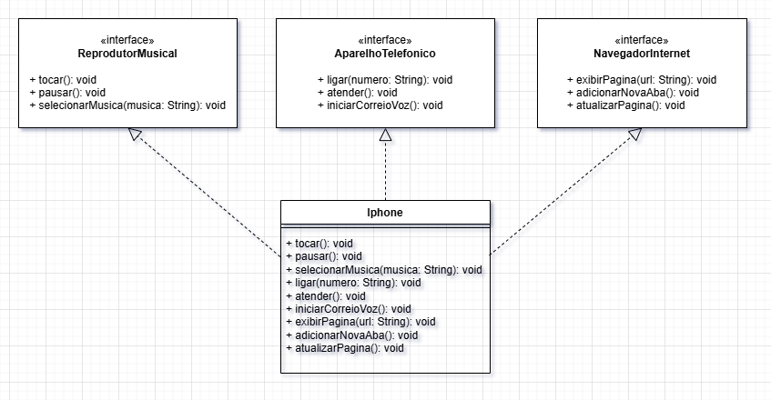

# 📱 Projeto: Modelagem UML do Componente iPhone

Este projeto tem como objetivo representar o componente `Iphone` com base nas funcionalidades demonstradas no lançamento do iPhone de 2007, utilizando conceitos de Programação Orientada a Objetos (POO) e UML.

## 🧩 Funcionalidades Modeladas

- **Reprodutor Musical**
  - `tocar()`
  - `pausar()`
  - `selecionarMusica(String musica)`

- **Aparelho Telefônico**
  - `ligar(String numero)`
  - `atender()`
  - `iniciarCorreioVoz()`

- **Navegador na Internet**
  - `exibirPagina(String url)`
  - `adicionarNovaAba()`
  - `atualizarPagina()`

## 📊 Diagrama UML

## 📁 Estrutura do Projeto

O projeto está dividido em três interfaces e uma classe principal `Iphone` que implementa todas elas.

---

> Projeto simples para fins educacionais – Bootcamp DIO Bradesco - Java Cloud Native.
